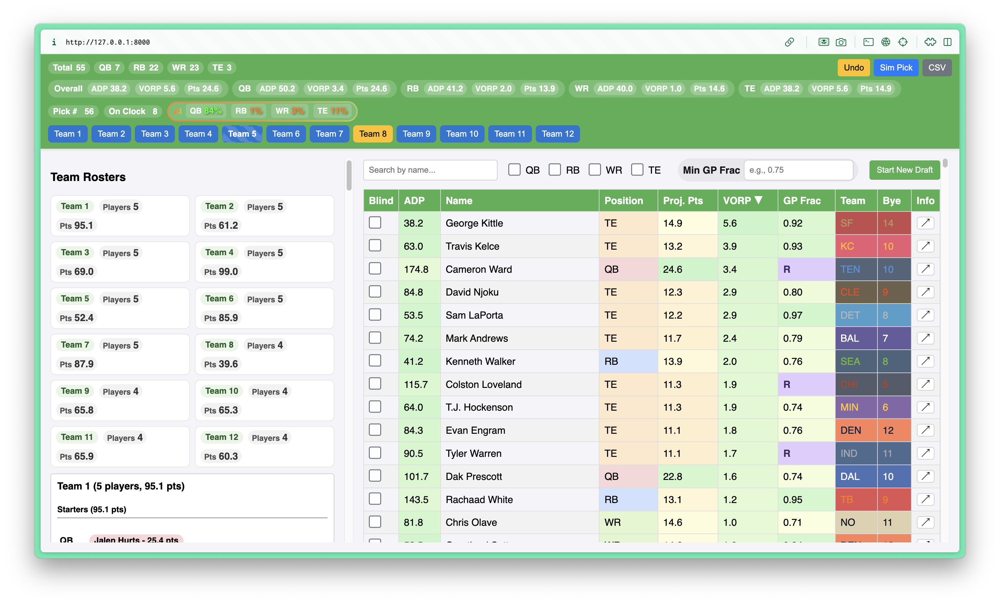
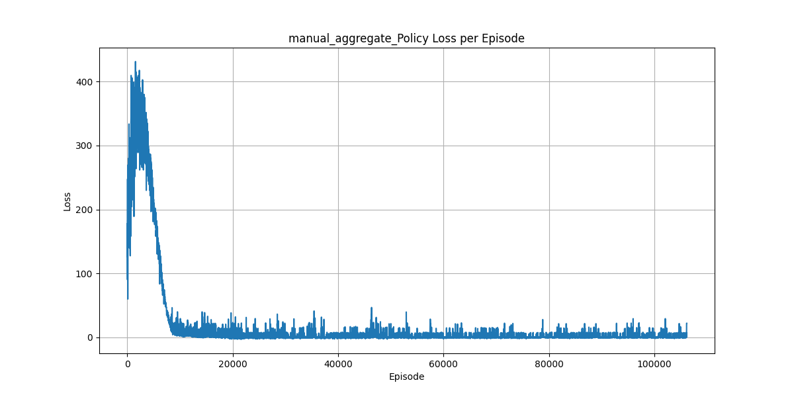
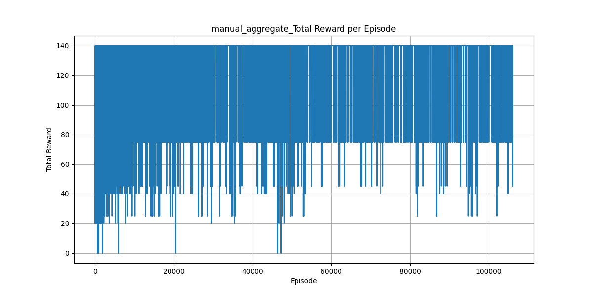

# Draft Buddy 🏈 - An AI-Powered Fantasy Football Draft Assistant

Draft Buddy is a complete system for simulating, training, and running a fantasy football draft assistant. It leverages reinforcement learning to train an AI agent to draft an optimal team by understanding player value, positional scarcity, and opponent behavior.

This project is more than just a draft simulator; it's a powerful tool for aspiring GMs to test strategies, train a personalized AI advisor, and get real-time suggestions during a live draft.





-----

## ✨ Key Features

  * **Customizable Draft Environment**: A custom OpenAI Gym environment models a multi-team snake draft with realistic roster rules, including a FLEX position.
  * **Intelligent Opponent Strategies**: Pit your AI against a range of opponent "personalities" from rule-based strategies (`ADP`, `HEURISTIC`, `RANDOM`) to other trained AI models. These can be randomized on the fly for robust training.
  * **Rich State Representation**: The agent's decision-making is powered by a comprehensive observation space that includes player value (`VORP`), positional scarcity, and opponent roster composition.
  * **Advanced Reward Functions**: Train your agent with flexible reward configurations, including per-pick shaping and a unique end-of-episode reward based on a full-season simulation. This rewards the agent for building a team that actually wins games, not just one with the highest projected points.
  * **Interactive Web UI**: A simple Flask backend and lightweight frontend allow you to run mock drafts, manually make picks, get real-time AI suggestions, and view detailed roster breakdowns.
  * **Extensive Analytics**: Simulate entire seasons to evaluate team performance, analyze draft results with CSV exports, and visualize training progress with intuitive plots.
  * **Docker-Ready**: The entire system is containerized, ensuring a consistent and isolated environment for all dependencies and making it easy to run anywhere.

-----

## 🚀 Getting Started

The easiest way to get started is by using Docker Compose.

### Prerequisites

  * [Docker](https://www.docker.com/get-started) and [Docker Compose](https://docs.docker.com/compose/install/) installed on your system.

### Installation & Setup

1.  **Clone the repository**:

    ```bash
    git clone https://github.com/your-username/draft-buddy.git
    cd draft-buddy
    ```

2.  **Start the application**:
    This command builds the Docker image and starts the Flask backend.

    ```bash
    docker compose up api
    ```

    To run the API in the background, use `docker compose up -d api`.

-----

## 🕹️ Running the Web App (UI)

1.  **Start the server** (from the project root):

    ```bash
    docker compose up api
    ```

2.  **Open the web UI**:
    Open your browser and navigate to `http://localhost:5001`.

The UI provides real-time controls and visualizations:

  * `Start New Draft`: Clears the current state and begins a new draft.
  * `Sim Pick`: Has the current team on the clock make an automatic selection.
  * `Undo`: Reverts the last pick.
  * `CSV`: Exports the entire draft history to a CSV file.
  * **Player List**: Filter, search, and sort through the available player pool.
  * **Team Rosters**: See a live breakdown of each team's roster, including starters, bench, and bye week conflicts.
  * **AI Suggestions**: Get real-time AI recommendations for the team on the clock.
  * **Sim Season**: Run a full season simulation based on current rosters to test the effectiveness of your draft.

-----

## 📈 Training the AI Agent

The core of Draft Buddy is the reinforcement learning agent trained with the REINFORCE algorithm.

1.  **Prepare your configuration**:
    Open `src/draft_buddy/config.py` and adjust parameters such as `TOTAL_EPISODES`, `LEARNING_RATE`, and `ENABLED_STATE_FEATURES`.

2.  **Start training** (from the project root):

    ```bash
    docker compose run --rm train
    ```

    The project directory is mounted into the container, so edits to `config.py` apply on the next run. Training progress, including rewards and losses, will be logged to the `logs/` directory on your host.

3.  **Resume training**:
    Set `RESUME_TRAINING = True` in `config.py` and the script will automatically find and load the latest checkpoint to continue training.

4.  **Plotting results**:
    To visualize your training metrics without starting a new training run, use the `-p` flag.

    ```bash
    docker compose run --rm train python scripts/train.py -p
    ```

    This generates an interactive HTML dashboard in the `logs/` directory.

-----

## 🧪 Simulation & Evaluation

Use a trained model to run multiple mock drafts and evaluate its performance.

1.  **Update the model path**:
    In `config.py`, ensure `MODEL_PATH_TO_LOAD` points to the `.pth` file of the trained agent you want to evaluate.

2.  **Run the simulation** (from the project root):

    ```bash
    docker compose run --rm simulation
    ```

    The script will output a detailed log of each pick and a summary of final team scores across all simulation runs, allowing you to see how your agent stacks up against its opponents.

-----

## 🗺️ Architecture diagrams (draft-arch)

The `arch_viz` module traces imports from one or more entry files and emits **Mermaid** diagrams of internal dependencies. Strategies: `module` (file-to-file), `class` (classes and inheritance), `function` (calls within reachable code).

**Entry points** commonly used in this repo:

| Role | Path |
|------|------|
| Web API | `api/app.py` |
| Training | `scripts/train.py` |
| Data preparation | `src/draft_buddy/utils/data_driver.py` |

**Using Docker Compose** (writes under `./viz` on the host: one file per entry plus `merged_module.mmd` showing the union; nodes list `entries: …` where multiple entry graphs overlap):

```bash
docker compose run --rm arch-viz
```

Override strategy or entries (arguments after `arch-viz` replace the service command):

```bash
docker compose run --rm arch-viz python -m draft_buddy.arch_viz.cli \
  --project-root /app --output-dir /app/viz --strategy class --all-default-entries
```

Single entry or custom list:

```bash
docker compose run --rm arch-viz python -m draft_buddy.arch_viz.cli \
  --project-root /app -O /app/viz -s module \
  --entry api/app.py --entry scripts/train.py
```

**Locally** (with `pip install -e .`):

```bash
# All default entries: separate files in ./viz plus merged diagram
python -m draft_buddy.arch_viz.cli --all-default-entries --output-dir viz --strategy module

# Stdout: merged graph when you pass multiple --entry values
python -m draft_buddy.arch_viz.cli -e api/app.py -e scripts/train.py -s module

draft-arch --entry api/app.py --strategy module
```

Paste the generated ` ```mermaid ` block into Markdown or [Mermaid Live Editor](https://mermaid.live).

-----

## 📊 Data preparation (player CSV)

Regenerate merged player data (writes to the path configured in `config.paths.PLAYER_DATA_CSV`, typically under `data/`):

```bash
docker compose run --rm data-prep
```

Other years or rookie projection options:

```bash
docker compose run --rm data-prep python -m draft_buddy.utils.data_driver --year 2024 --rookie_projection_method hybrid
```

Requires ADP CSV files in `data/` as expected by `FantasyDataProcessor` (see `data_driver` and config).

-----

## 🛠️ Project Structure

```
.
├── api/                        # Web API (Flask app)
├── data/                       # Draft data, matchups, and states
├── frontend/                   # UI static files
├── scripts/                    # Training and simulation scripts
├── src/draft_buddy/            # Main source package
│   ├── arch_viz/               # AST-based dependency / Mermaid diagram CLI
│   ├── config.py               # Central configuration
│   ├── draft_env/              # Core RL environment
│   ├── logic/                  # Draft services and strategies
│   ├── models/                 # Neural networks and agents
│   └── utils/                  # Utilities and data processors
├── Dockerfile                  # Container definition
├── docker-compose.yml          # Service orchestration
└── pyproject.toml              # Modern Python packaging
```

-----

## 📄 License & Acknowledgments

This project is open-sourced under the **MIT License**.

A special thanks to the open-source community behind Python, Gym, PyTorch, Pandas, Flask, and the various data sources used in this project. All player projections and logic should be adapted to your specific league's rules and data sources.
