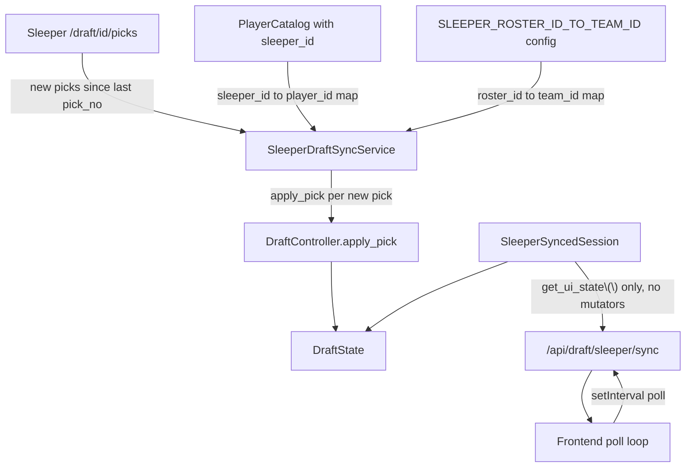

# Sleeper Live Draft Sync — Plan (Part 2)

## Part 1 Recap

Part 1 (implemented) refactored the offline data pipeline so **Sleeper is the source of player identity** and **nflverse is the source of legacy stats/projections**, joined by GSIS player id rather than name matching.

### Data layout

Raw inputs and generated artifacts are separated under `./data`:

| Path | Purpose |
| --- | --- |
| `data/cache/nflverse/` | nflverse `player_stats` / kicking stats and `roster_{year}.csv` (24h TTL, lazy refresh) |
| `data/cache/sleeper/` | Sleeper player directory JSON (24h TTL) |
| `data/cache/adp/` | Manually placed FantasyPros ADP CSVs (e.g. `FantasyPros_2026_Overall_ADP_Rankings.csv`) |
| `data/generated/{year}/` | Year-scoped diagnostics and archive copies (gitignored) |
| `data/generated_player_data.csv` | Canonical app input written on each run (ADP-matched skill players only) |

Path helpers live in `src/draft_buddy/data/cache_paths.py`.

### Pipeline flow

1. **`SleeperHttpGateway`** (`sleeper_client.py`) — fetches and caches the Sleeper player directory (`/v1/players/nfl`) and, when requested, a league's rostered players (`/v1/league/<league_id>/rosters`).
2. **`SleeperCatalogBuilder`** (`sleeper_catalog.py`) — filters the directory to draftable skill positions (`QB`/`RB`/`WR`/`TE`) where the player is on a team **or** is `Active` with a null team (covers free-agent veterans like Stefon Diggs). Sets internal `player_id = int(sleeper_id)`.
3. **`NflverseCsvDownloader.fetch_legacy_stats()`** (`nflverse_client.py`) — downloads aggregated weekly stats for `start_year`…`draft_year`; roster files are no longer the player pool, only cached for crosswalk metadata via `ensure_roster_cached()`.
4. **`NflverseCrosswalkBuilder`** (`nflverse_crosswalk.py`) — builds `sleeper_id → gsis_id` (+ `draft_number`) from Sleeper `gsis_id` first, merged nflverse roster history as fallback. GSIS normalization is shared in `nflverse_ids.py`.
5. **`FantasyDataProcessor`** (`data_processor.py`) — resolves `nflverse_player_id` on each catalog row, then **`ScoringService.attach_legacy_stats_by_player_id()`** left-joins legacy `total_pts` / `games_played_frac` onto the Sleeper catalog. Rows with no stats match (`total_pts` is NaN) are routed to rookie projection.
6. **`AdpMatcher`** (`adp_matcher.py`) — fuzzy-matches FantasyPros ADP onto the computed catalog using shared `standardize_name()` from `name_matching.py` (including combined `Player (Team / Bye)` column parsing). Only ADP-matched players land in the final CSV.
7. **`scripts/generate_projections.py`** — orchestrates the above; Docker `data` service defaults to `--year 2026`.

### Diagnostics written per run (`data/generated/{year}/`)

- `generated_player_data.csv` — archive copy of the merged output
- `borderline_adp_matches.csv` — fuzzy ADP matches in the 75–85 score band
- `sleeper_players_missing_nflverse_stats.csv` — catalog players with `years_exp > 0` and no stats match (review list; large/noisy because the base catalog includes many inactive Sleeper records)
- `sleeper_players_excluded_by_filter.csv` — only when `--sleeper_league_id` is passed; league-rostered players dropped by the catalog filter

### App-facing changes

- `Player` gained `sleeper_id`, `sleeper_status`, `sleeper_injury_status`, `sleeper_depth_chart_position`, threaded through `player_loader.py`, `/api/players`, and a "Status" column in the frontend player table.
- In generated player data, `player_id` and `sleeper_id` are the same integer (Sleeper's id).

### Part 1 known follow-ups (not blockers for Part 2)

- `bye_weeks_override` in `generate_projections.py` has no 2026 entry yet.
- DST units are outside `DRAFTABLE_POSITIONS` and remain ADP-unmatched by design.
- Rookie routing uses missing `total_pts`, not Sleeper `years_exp`; the missing-veterans report uses `years_exp > 0` only as a diagnostic filter.

The net effect for Part 2: every `Player` in the running app already carries its Sleeper id, internal `player_id` equals that Sleeper id, and the `SleeperGateway` abstraction for talking to Sleeper's API already exists.

## Part 2 Goal

Add a read-only "live sync" mode to the web UI: while an in-person/online Sleeper draft is happening, the app polls that draft's picks and mirrors them into the local `DraftState` so the user can see live stats (VORP, roster construction, bye-week conflicts, AI suggestions for opponents, etc.) without being able to accidentally make, undo, or override a pick through the UI. All actual picks are made on Sleeper; this app becomes a read-only dashboard over that draft.

## Architecture

## Integration With Part 1 (what gets reused vs. what's new)

This is the most important design point: **Part 2 should not rebuild any player-identity matching logic.** It only needs a few small additions on top of Part 1:

| Need in Part 2 | Source |
| --- | --- |
| Sleeper player id → internal `player_id` | Already solved. Part 1 sets `player_id = int(sleeper_id)` in the catalog, and generated player data carries both columns with the same value. Build a `{sleeper_id: player_id}` dict once per session by iterating `session.player_catalog` (or key directly on `player_id` when Sleeper pick payloads use Sleeper's `player_id` field) — no new matching code needed. |
| Fetching a draft's picks / draft metadata | **New.** `SleeperGateway` gets two new methods: `fetch_draft(draft_id)` (for `draft_order`, `slot_to_roster_id`, `type`) and `fetch_draft_picks(draft_id)`. Added directly to the existing `SleeperGateway` ABC/`SleeperHttpGateway` in `src/draft_buddy/data/sleeper_client.py` rather than a new gateway class. |
| Sleeper `roster_id` → internal `team_id` | **New, manual config.** Not derivable automatically and not something Part 1 solved (Part 1's `fetch_league_rosters` is only used for the catalog-filter reconciliation report via `--sleeper_league_id`, keyed by roster membership, not team identity). Add a `SLEEPER_ROSTER_ID_TO_TEAM_ID: Dict[int, int]` entry to `DraftConfig` in `src/draft_buddy/config.py`, set once per season alongside `TEAM_MANAGER_MAPPING`. |
| Player directory caching | Already solved — reused as-is via `sleeper_cache_dir()`; no changes needed to the daily-cache behavior. |

So Part 2 adds one new service (`SleeperDraftSyncService`) and two new gateway methods; everything else is composition over what Part 1 already built.

## New Components

- **`SleeperGateway` additions** (`src/draft_buddy/data/sleeper_client.py`):
  - `fetch_draft(draft_id) -> dict`: raw draft metadata (`draft_order`, `slot_to_roster_id`, `type`, `status`).
  - `fetch_draft_picks(draft_id) -> pd.DataFrame`: one row per pick (`pick_no`, `player_id`, `roster_id`, `draft_slot`).

- **`SleeperDraftSyncService`** (new module, `src/draft_buddy/data/sleeper_draft_sync.py`):
  - `build_draft_order(draft_id, roster_id_to_team_id) -> list[int]`: translates Sleeper's `draft_order`/`slot_to_roster_id` into an internal team-id draft order, used to seed `DraftState.draft_order` instead of `_generate_snake_draft_order()`.
  - `sync_new_picks(draft_id, draft_state, controller, sleeper_id_to_player_id, roster_id_to_team_id, last_synced_pick_no) -> int`: fetches picks, filters to `pick_no > last_synced_pick_no`, and calls `controller.apply_pick(team_id, player_id, is_manual_pick=False)` for each in order. Returns the new high-water-mark `pick_no` for persistence. Unresolvable players (no `sleeper_id` match at all) are logged and skipped rather than raising, since this must never crash mid-draft.

- **`SleeperSyncedSession`** (new, alongside `DraftSession` in `src/draft_buddy/web/session.py`, or a new `src/draft_buddy/web/sleeper_synced_session.py`):
  - Shares the read surface used today (`get_ui_state()`, `player_catalog`, `draft_history`, etc.) — ideally by extracting a small `DraftReadModel` protocol/ABC that both `DraftSession` and `SleeperSyncedSession` implement.
  - Does **not** implement `draft_player`, `undo_last_pick`, `transfer_player`, `set_current_team_picking`, `simulate_single_pick`, or `simulate_scheduled_picks_remaining`. It has no mutation surface at all, rather than a runtime "is this synced?" flag — so there's no code path in the interactive session that can accidentally be reached in sync mode, and no per-endpoint guard logic to keep in sync.
  - On construction: seeds `DraftState.draft_order` via `SleeperDraftSyncService.build_draft_order`, and persists/reloads `sleeper_draft_id` + `last_synced_pick_no` alongside the existing `DraftState` JSON file so a server restart resumes correctly.

- **New endpoints** (`src/draft_buddy/web/app.py`):
  - `POST /api/draft/sleeper/start` — body: `{draft_id, sleeper_league_id?}`. Creates a `SleeperSyncedSession` for the current cookie session, replacing whatever interactive session existed.
  - `GET /api/draft/sleeper/sync` — runs `SleeperDraftSyncService.sync_new_picks(...)` and returns `get_ui_state()`. This is the endpoint the frontend polls.
  - Existing mutation endpoints (`/api/draft/pick`, `/undo`, `/transfer`, `/override_team`, `/simulate_pick`, `/simulate_rest`) stay untouched — they simply won't function meaningfully against a `SleeperSyncedSession` since it has no mutation methods to call (fails fast with `AttributeError`/404-style behavior rather than silently doing nothing). Whether to give these a friendlier error for the synced case is a small follow-up decision, not a blocker.

- **Frontend**: a "Sync from Sleeper" toggle that prompts for a `draft_id`, then swaps the current click-driven `fetch` pattern for a `setInterval` polling `/api/draft/sleeper/sync` every few seconds, and hides/disables the pick/undo/transfer/override controls while active.

## Sequencing Within Part 2

1. Add `fetch_draft` / `fetch_draft_picks` to `SleeperGateway`/`SleeperHttpGateway` + tests (fixture-based, no live network calls, mirroring the existing `test_sleeper_client.py` style).
2. Add `SLEEPER_ROSTER_ID_TO_TEAM_ID` to `DraftConfig`.
3. Build `SleeperDraftSyncService` (`build_draft_order`, `sync_new_picks`) against a fake gateway + real `DraftController`/`DraftState` fixtures (reusing `tests/conftest.py`'s `draft_controller` fixture).
4. Extract the `DraftReadModel` interface from `DraftSession`'s existing read-only methods (a mechanical refactor, not a behavior change — should be covered by the existing `test_web_session.py` suite passing unchanged).
5. Add `SleeperSyncedSession` + the two new endpoints + persistence of `sleeper_draft_id`/`last_synced_pick_no`.
6. Frontend toggle + polling loop.

## Known Edge Cases (scoped for v1, explicitly deferred otherwise)

- **Player missing from catalog entirely**: `sync_new_picks` skips and logs rather than crashing; a follow-up could auto-insert a placeholder `Player` using Sleeper's own player attributes. Note: Part 1's final CSV is ADP-filtered (~400 skill players), so late-round or off-ADP Sleeper picks are the most likely misses — not a name-matching failure.
- **Non-snake draft types**: v1 assumes `type: "snake"`; auction/linear drafts are out of scope initially (`fetch_draft`'s `type` field makes detecting this trivial later).
- **Mid-draft trades**: ignored for v1 (`/traded_picks` not consulted); acceptable drift for a read-only reference view.
- **Resuming after a restart**: handled by persisting `sleeper_draft_id` + `last_synced_pick_no` in the same state file `DraftState` already uses.

## Inputs Needed From You Before Implementation

- The Sleeper `draft_id` (and `league_id`, if you also want the Part 1 catalog-filter reconciliation run via `--sleeper_league_id` against the same league) for the draft(s) you intend to sync.
- A one-time `roster_id → team_id` mapping for your league (can be derived by hand from `GET /v1/league/<league_id>/rosters` plus `GET /v1/league/<league_id>/users` the first time this is set up).
